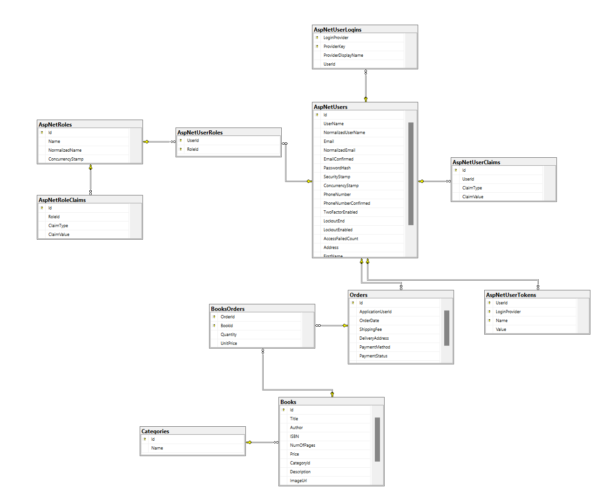
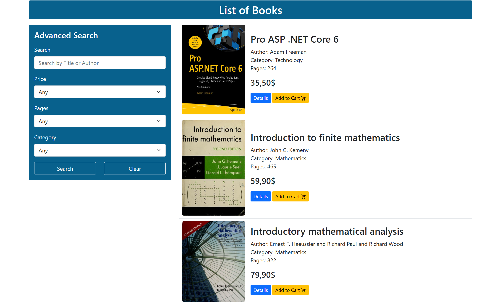
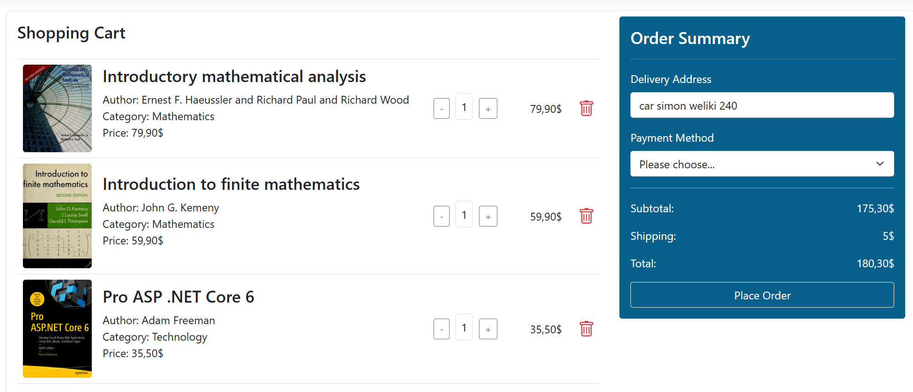
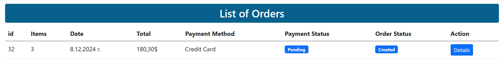

**Books shop** project using ASP .Net Core MVC.

## :hammer_and_pick: Built With

- ASP.NET Core MVC
- Entity Framework Core
- Microsoft SQL Server
- AutoMapper
- JavaScript
- Bootstrap 5, HTML, CSS and Font Awesome
- StyleCop
- Service and Repository Layers

## :bookmark_tabs: Short Description

A **Books Shop** app with two main roles - **Administrator** and **Client**.

The **Administrator** can add new books, update or delete existing ones. He can also view all incoming messages from site users and clients and can view details of all registered users and clients. All his action are facilitated by pagination, searching and sorting functionalities.

**Clients** can choose their favorite books and add them to their shopping cart, then make an order when they decide. Newest books and top sales are available on home page. Needed books can be easily found by advanced and combined search functionality - by author, title, price range, page range and book category.

## :cd: Database Diagram

## :camera_flash: Screenshots

**Home Page**

**Home Page - Top Sales**

**Books Advanced Search**

**Logged-in User Shopping Cart**

**Book Details**

**User Orders**

